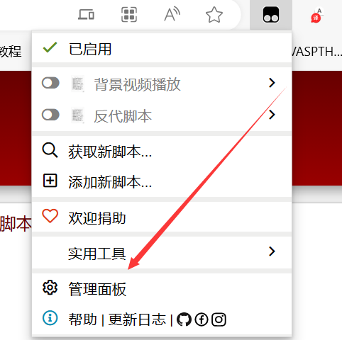

# UCAS-MOOC-AutoWatch
> 这个脚本适用于果壳`研一英语慕课`自动刷课，
> 主要通过油猴脚本来实现自动刷课和选课。
>
> 如果该项目对你有用，或者喜欢该项目，请不要吝啬点赞。

[中文版](README.md) | [English Version](REAMD-eng.md)
## 主要脚本:
[script1.js](src/script1.js) 用于自动刷课，主要是通过`setInterval`来实现的。

[script2.js](src/script2.js) 用于自动选课，主要是通过`MutationObserver`来实现的。

## 使用方法:

> 首先需要配置油猴脚本，该配置方案在主流视频网站都有教程，这里不过多介绍。

### 1.直接使用油猴下载：

**安装两个必须的脚本**

1. [✅国科大慕课自动刷课脚本: 版本1 (greasyfork.org)](https://greasyfork.org/zh-CN/scripts/477309-国科大慕课自动刷课脚本-版本1)

​	 2. [✅国科大慕课自动刷课脚本: 版本2 (greasyfork.org)](https://greasyfork.org/zh-CN/scripts/477732-国科大慕课自动刷课脚本-版本2)

### 2.使用油猴创建代码（此教程适用于方法1中的链接被举报下架）：

**打开油猴脚本页面**

**添加[script1.js](src/script1.js) 与[script2.js](src/script2.js) 到自定义脚本中**

直接复制即可，添加两个脚本在其中。

### 3. 启动脚本

1. 首先进入国科大英语慕课页面(不开脚本进入。)

1. 开启脚本，然后刷新一下页面，如果看到视频开始自动播放则证明已经成功，这个时候就可以不管了。

> 注： 可能存在刷完一章的课出现弹窗卡主的情况，此时取消脚本，重复1,2步骤即可解决。
