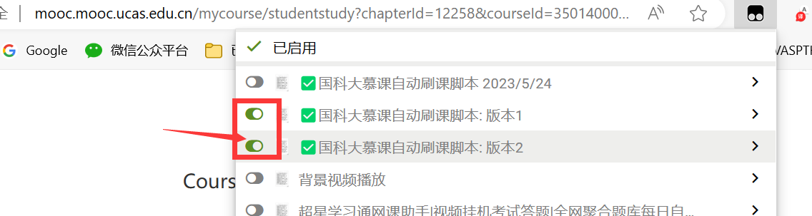

# UCAS-MOOC-AutoWatch
> This script is designed for the UCAS "First Year English MOOC" automatic course watching, mainly implemented through Tampermonkey scripts for automatic course watching and course selection.

> If you find this project useful or like it, please don't hesitate to give it a thumbs up.

[中文版](README.md) | [English Version](REAMD-eng.md)

## Main Scripts:
[script1.js](src/script1.js) is used for automatic course watching, mainly implemented through `setInterval`.

[script2.js](src/script2.js) is used for automatic course selection, mainly implemented through `MutationObserver`.

## How to Use:

> First, you need to configure the Tampermonkey script. There are tutorials on mainstream video websites, so I won't go into detail here.

### 1. Directly use Tampermonkey to download:

**Install the two required scripts**

1. [✅UCAS MOOC Auto Course Watching Script: Version 1 (greasyfork.org)](https://greasyfork.org/zh-CN/scripts/477309-国科大慕课自动刷课脚本-版本1)

​	 2. [✅UCAS MOOC Auto Course Watching Script: Version 2 (greasyfork.org)](https://greasyfork.org/zh-CN/scripts/477310-国科大慕课自动刷课脚本-版本2)

### 2. Use Tampermonkey to create code (this tutorial is for when the links in method 1 are reported and removed):

**Open the Tampermonkey script page**

**Add [script1.js](src/script1.js) and [script2.js](src/script2.js) to custom scripts**

Just copy and paste. Add both scripts to it.

### 3. Launch the script

1. First, go to the UCAS English MOOC page (enter without the script).

2. Turn on the script, then refresh the page. If you see the video starting to play automatically, it means it's successful. You can leave it running now.

> Note: There might be a pop-up window that gets stuck after finishing a chapter. In this case, turn off the script and repeat steps 1 and 2 to solve the issue.